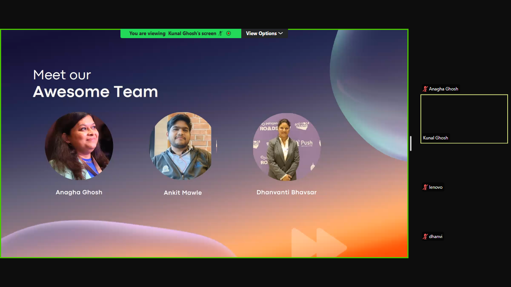
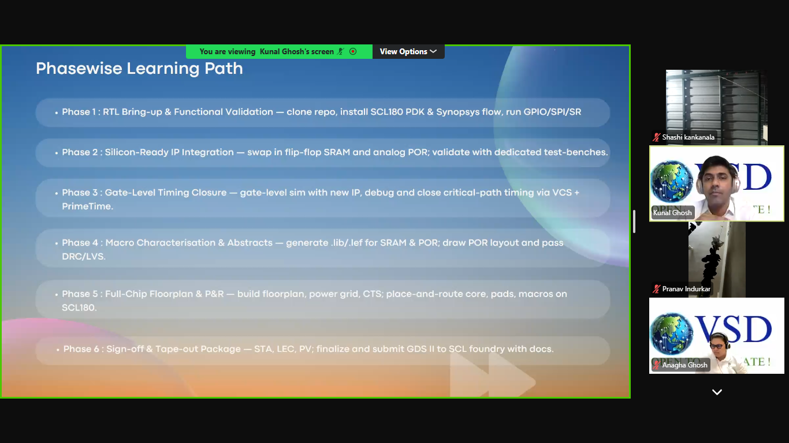
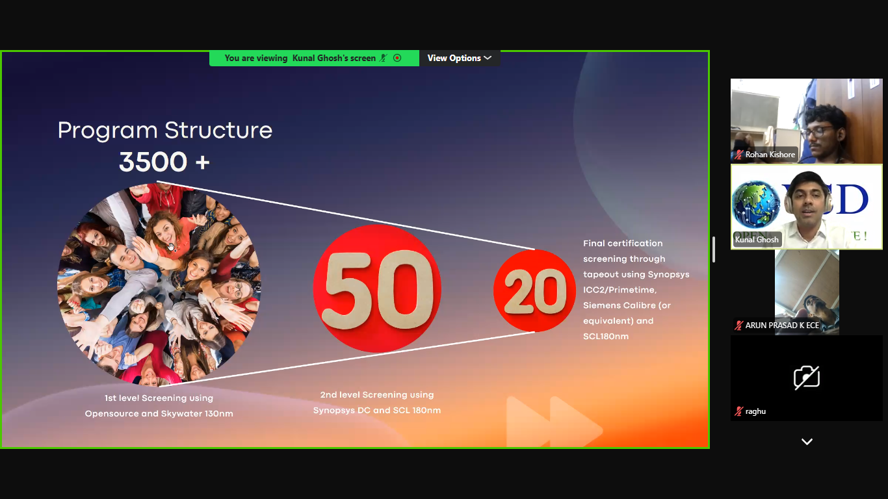

# 🚀 Week 0
## Task 1 :
## 🎥 Inauguration Video Summary  

The inauguration of the **India RISC-V Tapeout Program** marked a historic beginning in building the nation’s largest online academic tapeout initiative. With more than **3500 participants**, the program aims to collaboratively design, verify, and tapeout silicon chips.  

### Key Highlights from the Speakers  

- **Dr. Rajat Moona (Director, IIT Gandhinagar)**  
  Emphasized creating a **national framework for chip design talent** and encouraged participants to scale India’s semiconductor workforce to global standards.  

- **Samir Patel**  
  Representing the **India Semiconductor Mission (ISM)**, he highlighted India’s journey towards **self-reliance in semiconductors**, noting this program as part of a broader national movement.  

- **Mohamed Kassem**  
  Known for his open-source work at **Efabless** and now at **ChipFoundry**, he symbolized the **return of an open-source prodigy** who has opened silicon access to students and startups worldwide.  

---

## ✨ Student Reflections  

As a participant, I felt inspired by the energy of the inauguration.  
The message was clear:  

- Collaborate and learn together.  
- Understand the complete SoC tapeout flow.  
- Build strong skills to contribute to **India’s semiconductor growth story**.  

---

## ✅ Task Deliverables  

- Created a **GitHub repository** to document weekly progress.  
- Documented the **inauguration summary and reflections** in this file.  

---
## Screenshots

Here are some screenshots of the inauguration :

